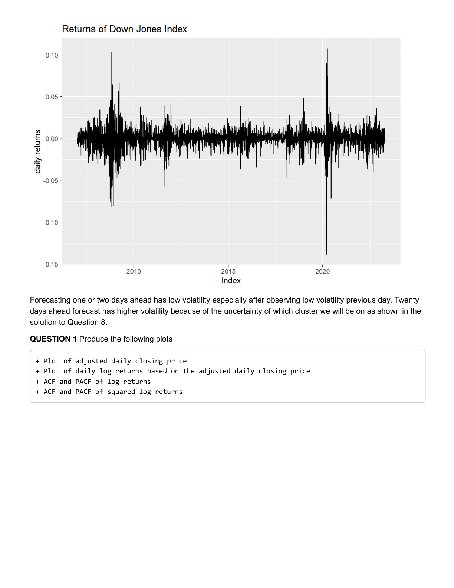
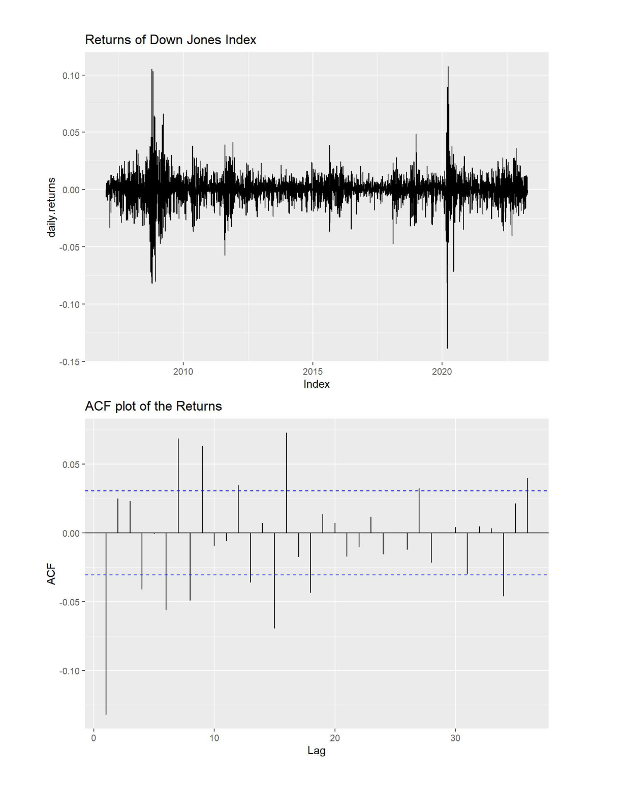
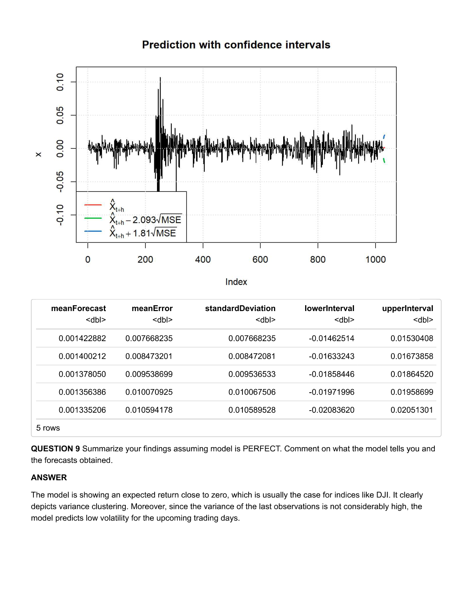

# AR-GARCH Modeling of Dow Jones Returns

This repository contains the work for **STAT 421/621 Project 2**, which studies **AR-GARCH modeling** for the daily returns of the **Dow Jones Index (DJI)**. The project analyzes volatility clustering in financial returns, fits several conditional volatility models, compares them using diagnostic tools and information criteria, and produces short-horizon forecasts for both returns and volatility. 
The project shows that while daily returns themselves do not display strong serial dependence, their volatility clearly does. This makes GARCH-type models appropriate for modeling the time-varying uncertainty in returns. After comparing several specifications, the preferred model is an **ARMA(1,1)-GARCH(2,0)** model with **skew-normal conditional distribution**, which improved the information criteria relative to models with normal innovations. 
---

## Project Overview

Financial return series often show little autocorrelation in the returns themselves, but they usually show strong dependence in their volatility. This phenomenon is known as **volatility clustering**, where periods of high volatility tend to be followed by high volatility and calm periods tend to be followed by calm periods. The goal of this project is to study this behavior in the **Dow Jones Index**, fit suitable AR-GARCH models, and produce forecasts for future returns and volatility.

The project uses daily return data for the **Dow Jones Index** and examines:

- the adjusted closing price series
- daily log returns
- ACF and PACF of returns
- ACF and PACF of squared returns
- AR-GARCH model fitting
- model comparison using diagnostics and information criteria
- 5-day forecasts for return and conditional standard deviation 
---

## Motivation

In financial time series, the key challenge is often not predicting the mean return, but predicting the **volatility of returns**. This matters in risk management, option pricing, and forecasting uncertainty. The project emphasizes that even if returns have weak linear dependence, the volatility process can still be highly persistent and informative.

---

## Data

The data used in the project are daily observations of the **Dow Jones Index**, obtained through the `getSymbols("^DJI")` command in R. The focus is on daily returns and their volatility behavior through time.
### Daily returns of the Dow Jones Index

The return series shows alternating periods of quiet variation and sharp spikes, especially around major stress periods such as 2008 and 2020. This is the first visual sign of volatility clustering.



Forecasting one or two days ahead under low-volatility conditions leads to lower predicted volatility, while forecasting after a volatile day leads to higher expected volatility. The project notes that the 20-day ahead forecast is more uncertain because it depends on which volatility regime will dominate in the future.

---

## Exploratory Analysis

The first stage of the project studies the return series and its serial dependence.

### ACF of returns

The ACF of returns shows relatively weak dependence overall, which is consistent with the usual behavior of financial return series.



### PACF of returns and ACF of squared returns

The PACF of returns again suggests limited structure in the return mean, while the ACF of squared returns shows strong persistence. This is one of the clearest signs that volatility is time-varying and clustered.


### PACF of squared returns

The PACF of squared returns also supports conditional heteroskedasticity, motivating the use of GARCH models.


---

## Models Considered

The project fits several AR-GARCH models using the `fGarch` package in R.

### Model 1: ARMA(1,0)-GARCH(1,0) with normal distribution

The first fitted model is an **ARMA(1,0)-GARCH(1,0)** with normal conditional distribution.

The estimation output shows statistically significant coefficients for the mean and volatility dynamics, and the model diagnostics provide a first baseline for comparison.


### Model 2: ARMA(1,0)-GARCH(2,0) with normal distribution

The second model extends the conditional variance to **GARCH(2,0)**. This increases flexibility in the variance equation and improves the fit.


### Model 3: ARMA(1,1)-GARCH(2,0) with skew-normal distribution

The final and preferred model includes:
- ARMA(1,1) in the mean
- GARCH(2,0) in the variance
- skew-normal conditional distribution

This model was selected because it improved the information criteria and addressed the heavy-tail and asymmetry issues better than the normal models. The report explicitly states that moving from a normal to a skew-normal conditional distribution improved the fit. 


---

## Model Selection

The project compares three fitted models and chooses the one that best represents the data based on model diagnostics and information criteria.

The chosen model is:

\[
\text{ARMA}(1,1) \text{-GARCH}(2,0) \quad \text{with skew-normal innovations}
\]

The report explains that:
- financial return series often violate the normality assumption
- using skew-normal innovations improved the information criteria
- the coefficients in the preferred model were statistically different from zero
- the preferred model better captured conditional variance dynamics :contentReference[oaicite:8]{index=8}

---

## Final Model

The project writes the final selected model in equation form. From the report, the fitted structure is:

\[
\mu_t = 9.24 \times 10^{-6} + 9.77 \times 10^{-1}\mu_{t-1} - 9.95 \times 10^{-1}\omega_{t-1} + \sigma_t u_t
\]

\[
\sigma_t^2 = 4.76 \times 10^{-5} + 2.56 \times 10^{-1} r_{t-1}^2 + 4.23 \times 10^{-1} r_{t-2}^2
\]

as reported in the project write-up. :contentReference[oaicite:9]{index=9}

---

## Standardized Residual Check

The project also plots the return series together with two conditional standard deviation bands. This is useful for visually checking whether the model captures the changing spread of returns over time.


This figure shows that large return moves tend to occur when the model-implied conditional standard deviation is elevated, which supports the use of the volatility model.

---

## Forecasting

The last part of the project produces forecasts for the next **5 trading days** for both:
- the return level
- the conditional standard deviation

### Forecast plot with confidence intervals



The forecast table in the final page shows:
- a mean forecast close to zero
- forecast standard deviations around 0.007 to 0.010
- prediction intervals widening with the horizon

The project interprets this as consistent with index returns: expected returns remain near zero, but the main forecasting interest lies in the volatility behavior. It also notes that since the last observed variance is not extremely high, the short-run forecast does not point to an explosive volatility episode.
---

## Main Findings

The main conclusions of the project are:

- The Dow Jones daily returns do not show strong linear dependence in the mean.
- The volatility clearly shows clustering.
- Squared returns display strong dependence, supporting GARCH modeling.
- The normality assumption is not ideal for financial returns.
- Allowing skewness in the conditional distribution improves fit.
- The preferred model is **ARMA(1,1)-GARCH(2,0)** with **skew-normal innovations**.
- The mean forecast remains close to zero, while conditional volatility remains the key predictable feature. 
---

## Repository Structure

A clean structure for this repository could be:

```text
.
├── README.md
├── R/
│   ├── data_download.R
│   ├── exploratory_analysis.R
│   ├── fit_garch_10.R
│   ├── fit_garch_20.R
│   ├── fit_skew_normal_model.R
│   ├── diagnostics.R
│   └── forecast_5days.R
├── project_figures/
├── results/
└── report/
    └── project.pdf
